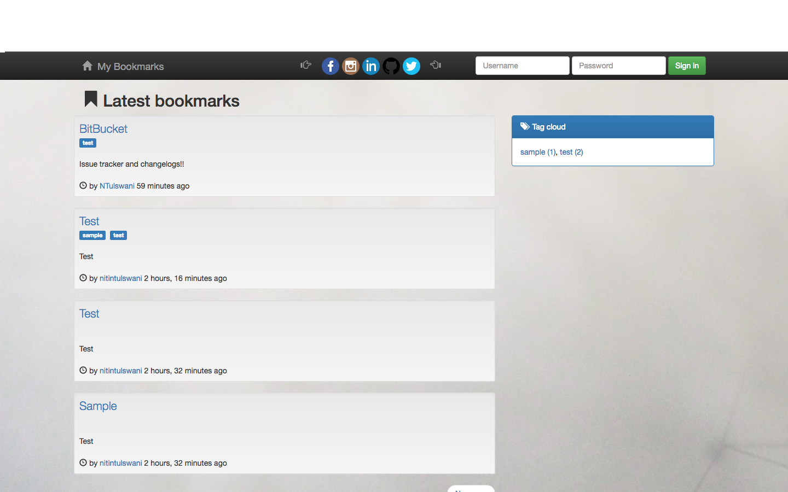

# My Bookmarks
A bookmark application in Django which stores users bookmarks from around the web. Just copy the url you wish to bookmark and create
a bookmark, THAT SIMPLE. 

courtsey of **Markus Zapke-Gründemann**

Screenshots

